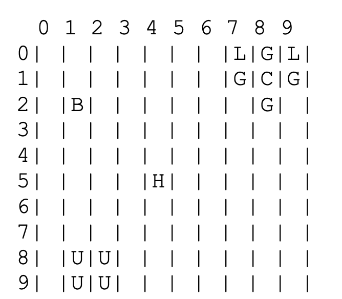

# Beeline Game

Welcome to Beeline, where you play as the queen bee, managing your hive's honey production to prepare for the winter. In this strategic game, you'll send out scout bees and worker bees to collect pollen from flowers while avoiding dangerous pitcher plants. Can you guide your bees to success and ensure the prosperity of your hive?

## Program Description

In Beeline, you control the queen bee and must manage scout and worker bees to collect pollen. Scout bees reveal the locations of flowers, while worker bees harvest pollen. Flowers can only be harvested once, and bees can only perform one task before returning to the hive. Beware of pitcher plants that can trap your bees!

The game field is represented as a rectangle with various symbols:
- H: Hive
- Letters: Different types of flowers
- U: Used flower (already harvested)
- P: Pitcher plant
- Space: Empty spot in the field

## Files

This project consists of three main Python files:

1. **BeeFunctions.py**: Contains functions required for playing the Beeline game, such as loading flower lists, creating fields, and checking bee areas.

2. **Beeline.py**: The main script for playing the Beeline game. It handles the game's execution, user interactions, and game logic.

3. **fieldGenerator.py**: Generates a randomly filled field for the Beeline game and saves it to a file. This script allows users to create custom fields for the game.

## Installation and Usage

1. Clone the repository:

git clone https://github.com/yourusername/beeline-game.git

2. Navigate to the project directory and run the main script:

cd beeline-game
python Beeline.py

Follow the prompts to play the game, sending out scout and worker bees to gather pollen.

## Contributions

Contributions are welcome! If you'd like to contribute to the project, please fork the repository and submit a pull request with your changes.

## Credits

This project was created by [Prayash Das].

## Feedback

If you have any feedback or suggestions, please feel free to [contact us](mailto:dasprayash07@gmail.com).

